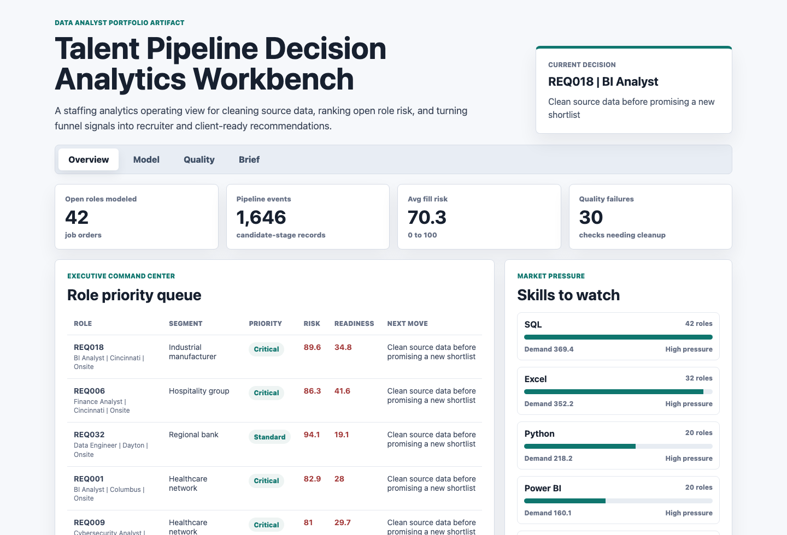
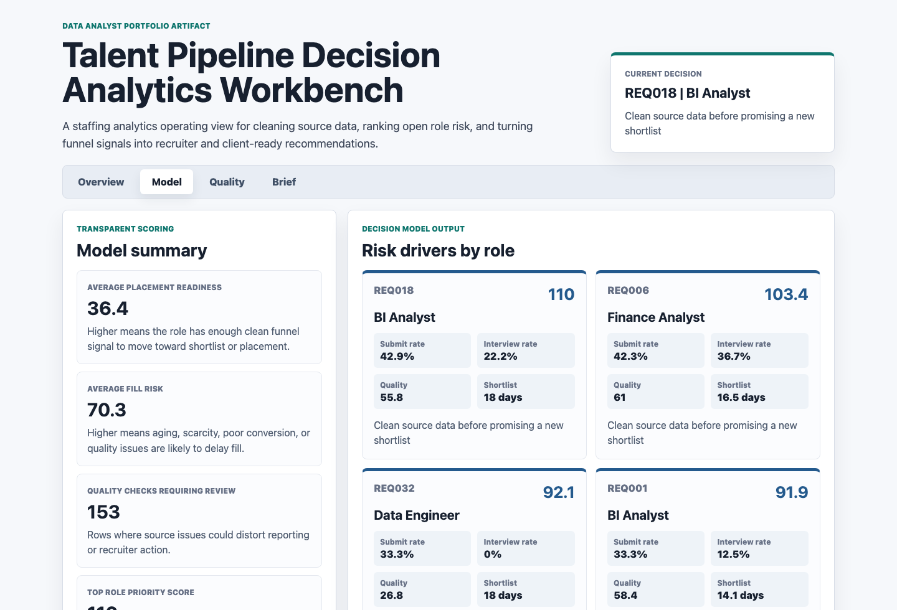
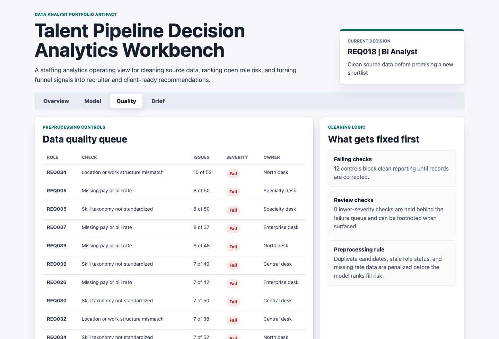
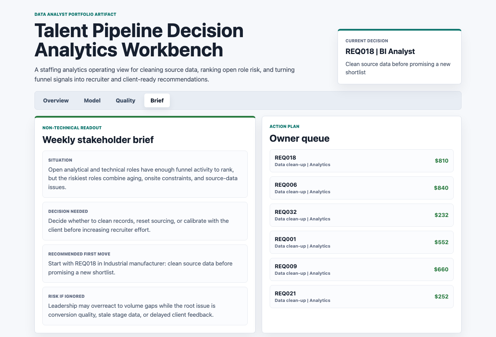

# Talent Pipeline Decision Analytics Workbench

An interactive data analyst portfolio artifact for a Midwest talent solutions and staffing analytics team. The workbench shows how messy job-order, candidate pipeline, data-quality, and market-skill signals can be cleaned, modeled, visualized, and translated into recruiter and client-ready decisions.

## Screenshots



The executive command center ranks open analytical and technical roles by fill risk, placement readiness, source-data quality, and recommended next move.



The model surface explains the transparent scoring logic behind each priority role, including submit rate, interview rate, data quality, expected shortlist timing, and the recommendation.



The quality surface turns preprocessing checks into an operating queue for duplicate candidates, stale role status, missing rate data, location mismatches, skill taxonomy gaps, and late stage backfills.



The brief surface converts the analysis into non-technical talking points and an owner-level action queue for the weekly recruiting or client review.

## What This Project Demonstrates

- Collecting and shaping multi-source staffing data into an analyst-ready model.
- Cleaning and preprocessing candidate pipeline records before reporting.
- Using Python to generate synthetic data, score role risk, and write decision outputs.
- Using SQL-style validation checks to test funnel math, nulls, duplicates, and stage consistency.
- Building a BI-style front end that communicates findings to non-technical stakeholders.

## Data Sources

All data is synthetic and generated by `scripts/score_operating_data.py`. It is modeled on common staffing and talent-delivery workflows, not on any real employer, candidate, client, applicant tracking system, or recruiting platform.

The generator creates:

- `data/job_orders.csv`: 42 synthetic open job orders across analytics, BI, finance, ERP, cybersecurity, and data engineering role families.
- `data/weekly_funnel_metrics.csv`: 336 weekly funnel rows covering applicants, qualified candidates, screens, submissions, interviews, offers, placements, dropoffs, and recruiter touches.
- `data/candidate_pipeline_events.csv`: 1,646 synthetic candidate-stage events with source channel, stage, profile completeness, duplicate flags, missing-rate flags, location mismatches, skill taxonomy gaps, and estimated margin value.
- `data/data_quality_checks.csv`: role-level preprocessing checks for missing pay rates, stale statuses, duplicate candidates, location mismatches, skill taxonomy gaps, and stage backfills.
- `data/market_skill_signals.csv`: synthetic skill-demand and supply-pressure indicators used to contextualize hard-to-fill roles.
- `data/recommended_actions.csv`: decision-ready action candidates generated from the scored queue.

The assumptions are intentionally transparent:

- Onsite roles receive more scarcity pressure than hybrid or remote roles.
- Critical roles carry a higher operating weight than standard roles.
- Data quality issues reduce placement readiness before role risk is ranked.
- Submit, interview, and offer conversion rates are calculated from generated weekly funnel counts.
- Expected shortlist timing rises when roles age, quality degrades, or submit rates fall.

## Analysis Outputs

- `analysis/outputs/role_priority_queue.csv`: ranked role queue with placement readiness, fill risk, data quality, expected shortlist days, estimated margin exposure, and recommendation.
- `analysis/outputs/data_quality_queue.csv`: failed or watched preprocessing checks.
- `analysis/outputs/model_summary.csv`: model-level metrics and plain-English interpretations.
- `analysis/outputs/stakeholder_brief.csv`: non-technical readout sections.
- `analysis/outputs/app_payload.json`: data payload used by the browser workbench.
- `analysis/sql_checks.sql`: SQL-style validation checks for reporting and QA review.

## How To Run

```bash
npm run analyze
npm start
```

Then open `http://localhost:4173`.

## Scope

This is a static portfolio artifact with deterministic synthetic data and transparent scoring. It does not connect to a live ATS, CRM, HRIS, job board, payroll system, BI tenant, cloud warehouse, or client environment. It does show a defensible analyst workflow for cleaning data, modeling staffing pipeline risk, visualizing KPIs, and communicating recommendations.
